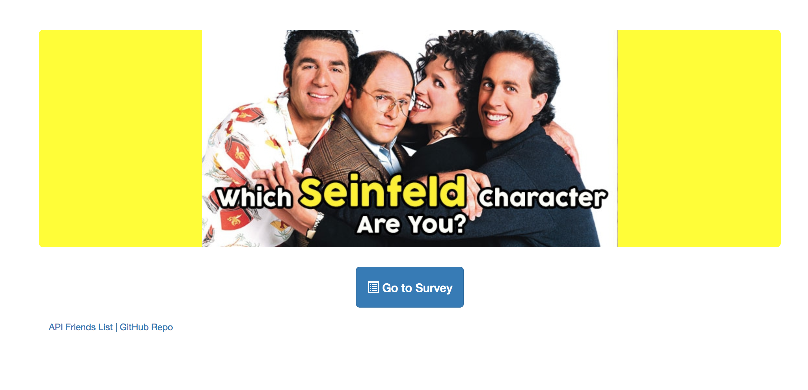
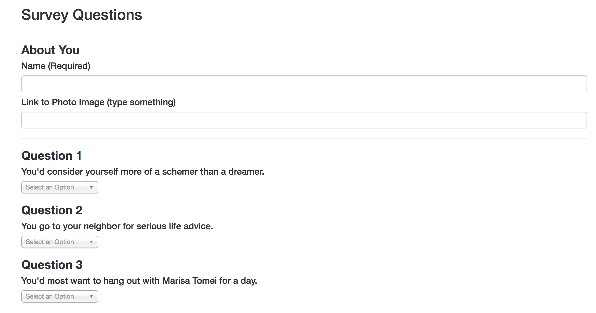

# friendfinder
## Table of Contents

* [About the Project](#about-the-project)
  * [Built With](#built-with)
* [Getting Started](#getting-started)
  * [Prerequisites](#prerequisites)
  * [Installation](#installation)
* [Usage](#usage)
  * [Screenshots](#sceenshots)
* [Contact](#contact)
* [Acknowledgements](#acknowledgements)

## About The Project
FriendFinder is a Seinfeld character matching app. It is a full-stack site that will take in results from user's surveys, then compare their answers with those from other users. The app will then display the name and picture of the user with the best overall match. [app website](https://friend-finder-seinfeld-24.herokuapp.com/)

### Built With
* HTML
* CSS
* [Bootstrap](https://getbootstrap.com/)
* JavaScript
* [jQuery](https://jquery.com/)
* [Node.js](https://nodejs.org/en/)
* [npm](https://www.npmjs.com/)
* [Express](https://expressjs.com/)

## Getting Started

### Prerequisites
* A web browser to display the application

### Installation  
No installation is required.

## Usage
1. Visit  the [app website](https://friend-finder-seinfeld-24.herokuapp.com/)
2. Click "Go to Survey"
3. Fill out the answers based on your preferences
4. Once finished filling out the survey, click submit to see your results

### Screenshots
1. Landing Page

2. Survey

## Contact
Marisa Ramon - [LinkedIn](https://www.linkedin.com/in/marisaramon/) - mer0522@gmail.com 
Project Link: [https://github.com/mpieces/FriendFinder](https://github.com/mpieces/FriendFinder)

## Acknowledgements
* [npm](https://www.npmjs.com/)
* [font-awesome](https://fontawesome.com/)

